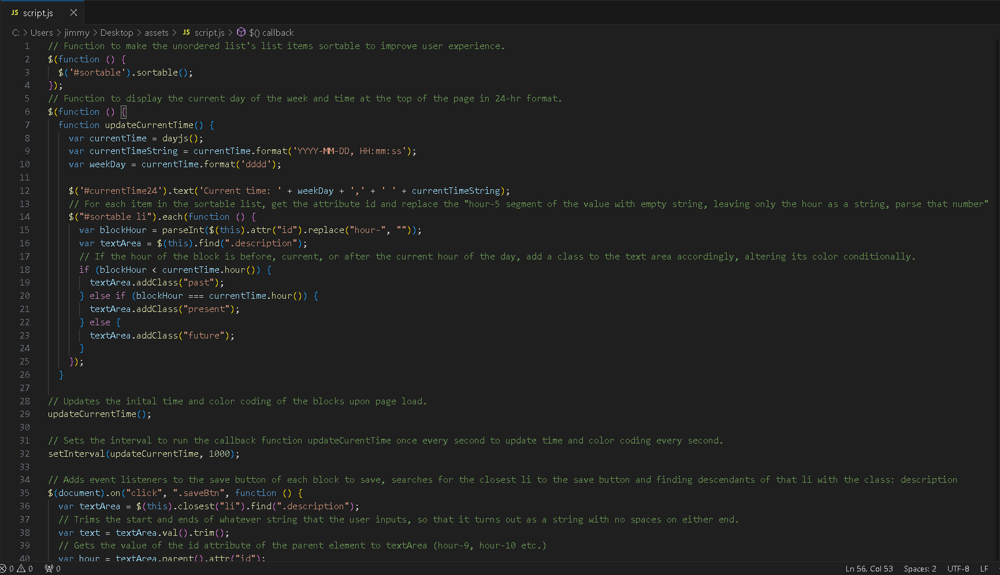
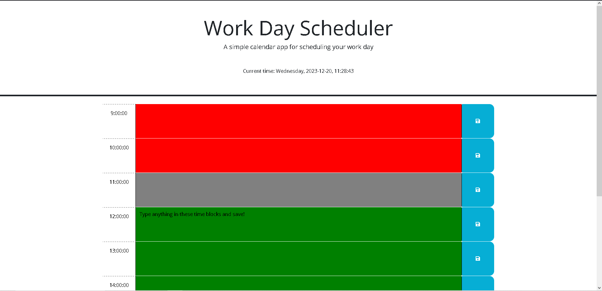

# Work-Day-Scheduler
## Codebase for a Work Day Scheduler Application

## Description
The purpose of this project was to create a work day scheduler app for people who like keeping their lives organized! The web application lets users consider the timeliness in which they complete their tasks throughout their work day (refer to index.html, assets > style.css & script.JS for codebase) by dynamically updating the timeblock colors to reflect whether the task is in the past, present, or future. This scheduler is an improvement to that of a static sticky note generated by the Windows in-built application in that the JavaScript of this scheduler accounts for the time aspect. With that said, it can serve as a great organizational tool given that user input is stored locally and persists upon page load.

## Learnings/takeaways
Takeaways from completing this project include the application of concepts surrounding the dayJS library and dayJS objects, particularly when it came to representing the current time and date of the user's local browser timezone. Understanding how to traverse the DOM tree based on conditional logic and dynamically assigning classes to certain elements was a new learning experience when it came to exploring the possibilities of JavaScript and building out this project. 

        
## Installation
N/A

## Usage 
Go to link: https://jpwu23.github.io/Jimmy-Wu-Portfolio/ Click any area of the time block to start typing a task. When you're done, click the corresponding save button to save the task (this will be saved in the local storage so that it persists upon page reload). Drag the time blocks and arrange them however you would like them to be organized. Time blocks will be color coded based on whether this time block is now expired (red), current (grey), or in the future (green) according to the current time at the top of the webpage (which is set to the user's local browser timezone by default).

## Credits
ChatGPT, University of Sydney/edX Coding Bootcamp course resources. 

## License
N/A
